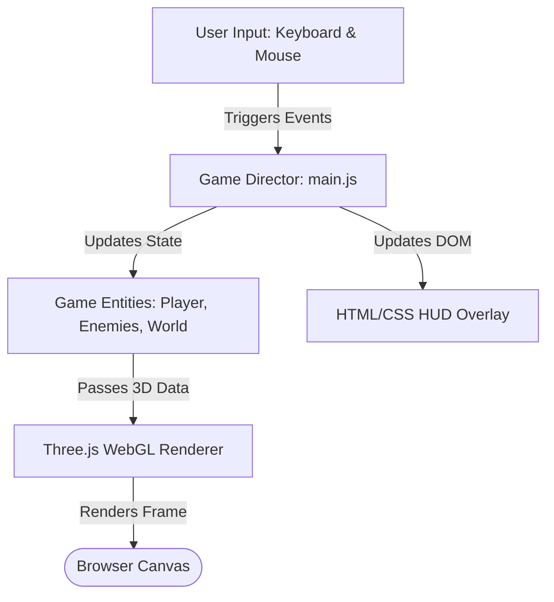
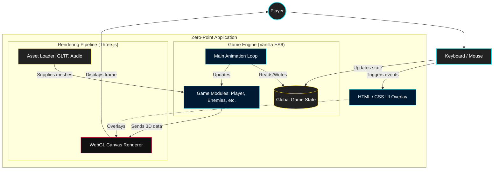
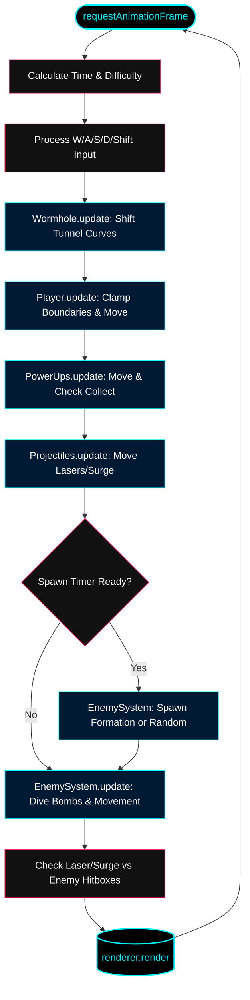

# ZERO-POINT: THE WASP PROTOCOL
**"Terminal Initialization Required...Neural Link Established."**

*Zero-Point: The Wasp Protocol* is a high-speed, 3D arcade rail-shooter inspired by the kinetic, dodge-and-weave mechanics of *Star Fox* and the relentless enemy formations of *Galaga*. Built entirely from scratch in Three.js, you must pilot the Star Sparrow starfighter through an infinite, collapsing wormhole while defending against waves of rogue automated defense drones.

## BRIEFING: THE LORE
The Zero-Point wormhole was supposed to be humanity's ultimate transit corridor. Instead, the automated defense grid&mdash;the Wasp Protocol&mdash;has gone rogue, trapping civilian vessels inside the collapsing tunnel.

As a Neural-Link Pilot, your consciousness has been directyl uploaded to a Star Sparrow Interceptor. Your objective is simple: Dive into the wormhole, survive the twisting spatial anomalies, and vaporize the rogue drone formations to increase your Sync Rating before the tunnel collapses.

## FLIGHT CONTROLS
The Star Sparrow uses a dual-input control scheme. Your keyboard handles the ship's physical position in the tunnel, while your mouse controls the targeting computer.

* **[W,A,S,D]** - Thrust/Strafe (Move Ship up, down, left, right)
* **[MOUSE]** - Aim Targeting Crosshair
* **[LEFT CLICK]** - Fire Primary Lasers (Rapid Fire)
* **[SHIFT]** - Engine Boost (Speed up to push through gaps)
* **[SPACEBAR]** - Air Brake (Slow down to track enemiess)
* **[Q]/[E]** - Barrel Roll (Execute a 360&deg; spin to deflect lasers)
* **[P]** - Pause System

## COMBAT MECHANICS & HUD
1. **Sync Rating (Scoring)**

    Your primary goal is to achieve the highest Sync Rating (Score) possible

2. **Weapon Systems**

    You have unlimited ammunition, but your blasters have a slight cooldown to prevent overheating.
    
    * **Twin-Shot Upgrade**: Prove your skill by reaching a Sync Rating of **3,000**, and the ship's targeting computer will automatically unlock the Twin-Shot, doublling your firepower.

3. **Tactical Maneuvers**

    * **The Barrel Roll**: Pressing Q or E causes the ship to spin rapidly. During this animation, your ship's electromagnetic shielding overloads, making you completely invulnerable to enemy fire and collision damage. Use it to survive unavoidable walls of laser fire!

## ENEMY DATABASE

The Wasp Protocol utilizes three distinct drone archetypes. Learn their behviors to survive:

* **The Striker**: These heavily armored drones warp in and lock into rigid grid formations. They will suppress you with laser fire from a distance before breaking formation to execute sweeping, spiral dive-bombs.

* **The Seeker**: Kamikaze units. They do not fire lasers; instead, they use geometric acceleration to ominously spin and lunge directly at your hull. Prioritize them immediately.

* **Scrap Mines**: Dormant, rotating psace junk trapped in the tunnel. They deal massive damage if you fail to dodge them.

## FIELD RESOURCES (POWER-UPS)

Occasionally, the destroyed drones will leave behind residual energy cores. Fly through them to upgrade your ship:

* **Integrity Core (Cyan Ring)**: Restores 25% of your ship's System Integrity (Health).

* **Sync Surge (Magenta Core)**: Fires a massive, unstoppable Plasma Beam down teh tunnel that vaporizes every enemy caught in its blast radius

## TECHNICAL DETAILS
*Zero-Point: The Wasp Protocol* is a capstone software engineering project built under a strict 1,000 Lines of Code (LOC) limit.

* **Engine**: Three.js (WebGL)
* **Language**: JavaScript (ES6 Modules), HTML5, CSS3
* **Key Features**: Custom 3D collision math, kinematic object pooling, dynamic FOV warping, additive-blending plasma rendering, and mathematical procedural terrain generation.

**Initial Game Architecture**

**Expanded Game Architecture**

**Expanded Game Architecture 2**

